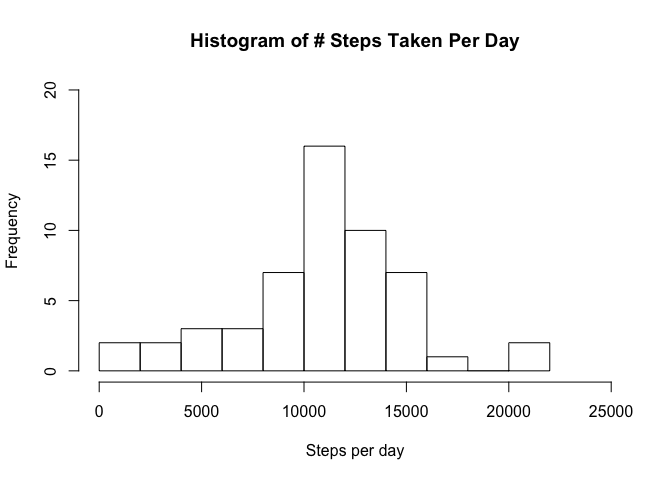
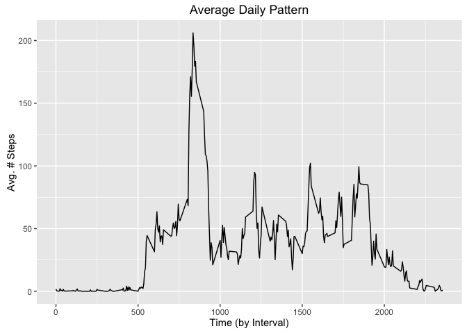
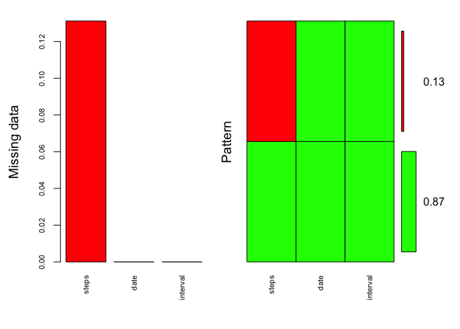
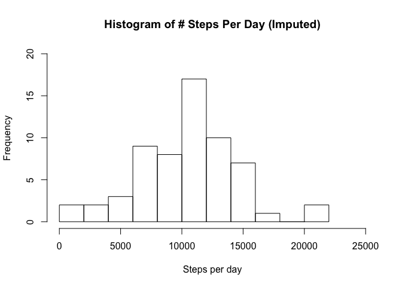
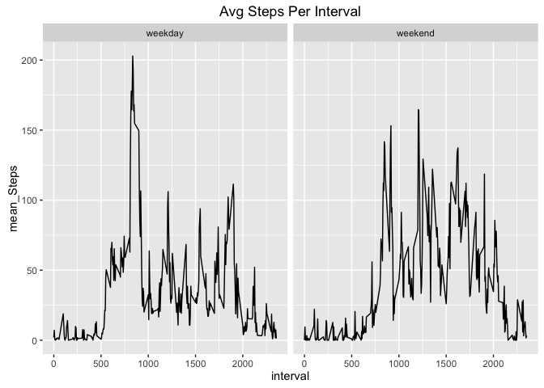

# Reproducible Research: Peer Assessment 1
Note - before running this project document, please make sure to set your working directory to this file's current directory using the following command: 

setwd(/directory/where/this/file/is/stored)


## Loading and preprocessing the data


```r
# set data directory
data_dirname <- "./input" 
if (!file.exists(data_dirname)){
  dir.create(data_dirname)
}

# source URL of the data
url = "https://d396qusza40orc.cloudfront.net/repdata%2Fdata%2Factivity.zip"

# download and unzip the data
temp <- tempfile(tmpdir = data_dirname, fileext = ".zip")
download.file(url, temp)
unzip(temp, exdir = data_dirname)
unlink(temp)

# get file path(s) for data files
input_file_paths = list.files(data_dirname, full.names = T, recursive = T)

# read data into R for each file
for (i in 1:length(input_file_paths)) {
  key <- paste("data", i, sep="_")
  assign(key, read.table(input_file_paths[i], header = T, sep=",")) 
}

# remove rows with NAs
data_2 <- data_1[complete.cases(data_1), ]
```

## What is mean total number of steps taken per day?


```r
# get total steps per day
steps_per_day <- data.frame(aggregate(steps ~ date, data_2, sum))

# histogram plot
hist(steps_per_day$steps, breaks = 10, xlim = c(0, 25000), ylim = c(0, 20), xlab = "Steps per day", main="Histogram of # Steps Taken Per Day")
```

<!-- -->

```r
summary(steps_per_day$steps)[4]
```

```
##  Mean 
## 10770
```

## What is the average daily activity pattern?


```r
library(ggplot2)
library(lubridate)
```

```
## 
## Attaching package: 'lubridate'
```

```
## The following object is masked from 'package:base':
## 
##     date
```

```r
data_2$date <- ymd(data_2$date)
avg_steps_by_interval <- data.frame(aggregate(steps ~ interval, data_2, mean))
ggplot(avg_steps_by_interval, aes(interval, steps)) +
  geom_line() + ggtitle("Average Daily Pattern") + xlab("Time (by Interval)") + ylab("Avg. # Steps")
```

<!-- -->

```r
# Calculate the 5-minute interval that, on average, contains the maximum number of steps

avg_steps_by_interval[which.max(avg_steps_by_interval$steps), 1]
```

```
## [1] 835
```

## Imputing missing values


```r
# Code to describe and show a strategy for imputing missing data

library(mice)
```

```
## Loading required package: Rcpp
```

```
## mice 2.25 2015-11-09
```

```r
library(VIM)
```

```
## Loading required package: colorspace
```

```
## Loading required package: grid
```

```
## Loading required package: data.table
```

```
## 
## Attaching package: 'data.table'
```

```
## The following objects are masked from 'package:lubridate':
## 
##     hour, mday, month, quarter, wday, week, yday, year
```

```
## VIM is ready to use. 
##  Since version 4.0.0 the GUI is in its own package VIMGUI.
## 
##           Please use the package to use the new (and old) GUI.
```

```
## Suggestions and bug-reports can be submitted at: https://github.com/alexkowa/VIM/issues
```

```
## 
## Attaching package: 'VIM'
```

```
## The following object is masked from 'package:datasets':
## 
##     sleep
```

```r
mice_plot <- aggr(data_1, col=c('green','red'),
                  numbers=TRUE, sortVars=TRUE,
                  labels=names(data_1), cex.axis=.7,
                  gap=3, ylab=c("Missing data","Pattern"))
```

<!-- -->

```
## 
##  Variables sorted by number of missings: 
##  Variable     Count
##     steps 0.1311475
##      date 0.0000000
##  interval 0.0000000
```

```r
imputed_data <- mice(data_1,m=5,maxit=50,meth='pmm',seed=500, print = FALSE)
completedData <- complete(imputed_data,1)

# Histogram of the total number of steps taken each day after missing values are imputed
steps_per_day_imputed <- data.frame(aggregate(steps ~ date, completedData, sum))

hist(steps_per_day_imputed$steps, breaks = 10, xlim = c(0, 25000), ylim = c(0, 20), xlab = "Steps per day", main="Histogram of # Steps Per Day (Imputed)")
```

<!-- -->

## Are there differences in activity patterns between weekdays and weekends?


```r
library(dplyr)
```

```
## -------------------------------------------------------------------------
```

```
## data.table + dplyr code now lives in dtplyr.
## Please library(dtplyr)!
```

```
## -------------------------------------------------------------------------
```

```
## 
## Attaching package: 'dplyr'
```

```
## The following objects are masked from 'package:data.table':
## 
##     between, last
```

```
## The following objects are masked from 'package:lubridate':
## 
##     intersect, setdiff, union
```

```
## The following objects are masked from 'package:stats':
## 
##     filter, lag
```

```
## The following objects are masked from 'package:base':
## 
##     intersect, setdiff, setequal, union
```

```r
completedData <- completedData %>%
  mutate(day_of_week = wday(date)) %>% 
  mutate(weekday_weekend = ifelse(day_of_week == 1 | day_of_week == 7,"weekend", "weekday"))

# convert weekday_weekend to factor values
completedData$weekday_weekend <- factor(completedData$weekday_weekend)

summaryData <- completedData %>%
  group_by(weekday_weekend, interval) %>%
  summarise(mean_Steps = mean(steps))

ggplot(summaryData, aes(interval, mean_Steps)) +
  geom_line() + facet_grid(. ~ weekday_weekend) + ggtitle("Avg Steps Per Interval")
```

<!-- -->
